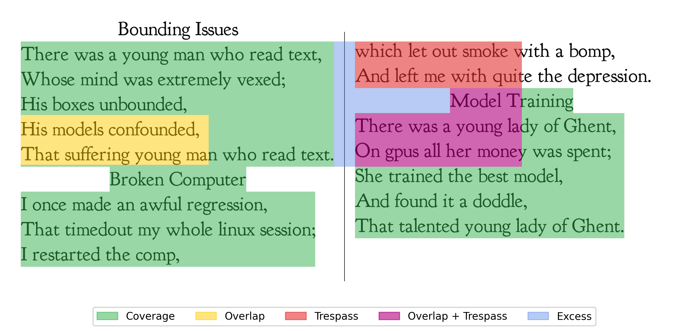

# cotescore

**Coverage, Overlap, Trespass and Excess (COTe) score for Document Layout Analysis**

[](https://pypi.org/project/cotescore/)
[](https://www.python.org/downloads/)


## Overview

Document Layout Analysis (DLA) is the process of parsing a page into meaningful elements, typically using machine learning models. Traditional evaluation metrics such as IoU, F1, and mAP were designed for 3D-to-2D image projections (e.g. photographs) and can give misleading results for natively 2D printed documents.

**cotescore** introduces two complementary ideas:

- **Structural Semantic Units (SSUs)** — a relational labelling approach that shifts focus from the physical bounding boxes of regions to the semantic structure of the content.
- **COTe Score** — a decomposable metric that breaks page-parsing quality into four interpretable components:
  - **C**overage — how well predictions cover ground-truth regions
  - **O**verlap — redundant predictions within the same ground-truth region
  - **T**respass — predictions that cross semantic boundaries into a different SSU
  - **e**xcess — A support metric for predictions that fall on background or white-space

COTe is more informative than traditional metrics, reveals distinct model failure modes, and remains useful even when explicit SSU labels are unavailable.

## Installation

```bash
pip install cotescore
```

### Optional extras

The benchmarking extras include either PyTorch or PaddlePaddle — **do not install both in the same environment**. These frameworks require different CUDA versions and will conflict:

| Extra | Use case | GPU framework |
|---|---|---|
| `cotescore[benchmarks]` | Torch-based DLA models (DocLayout-YOLO, Heron) | PyTorch |
| `cotescore[paddle-benchmark]` | PaddleOCR / PP-DocLayout | PaddlePaddle |

```bash
# Torch-based benchmarks
pip install "cotescore[benchmarks]"

# PaddlePaddle benchmarks (install PaddlePaddle first, separately)
# See: https://www.paddlepaddle.org.cn/install/quick
pip install "cotescore[paddle-benchmark]"
```

> **Note:** PaddlePaddle must be installed before `cotescore[paddle-benchmark]` — it is not listed as a pip dependency because the correct wheel depends on your CUDA version. Follow the [PaddlePaddle installation guide](https://www.paddlepaddle.org.cn/install/quick) to get the right version.

## Quick Start

The library ships with a bundled limerick case study that you can use to try it out immediately.

```python
from cotescore import cote_score, load_limerick_example, extract_ssu_boxes
from cotescore.adapters import boxes_to_gt_ssu_map, boxes_to_pred_masks, eval_shape

# Load the bundled example: ground-truth dict, document image, and example predictions
ground_truth, image, pred_boxes = load_limerick_example()

h, w = image.shape[:2]
_, _, scale = eval_shape(w, h)

# Build tagged SSU-level GT boxes and rasterize to a 2-D SSU id map
gt_boxes = extract_ssu_boxes(ground_truth)
gt_ssu_map = boxes_to_gt_ssu_map(gt_boxes, w, h, scale=scale)
preds = boxes_to_pred_masks(pred_boxes, w, h, scale=scale)

# Compute the COTe score
cote, C, O, T, E = cote_score(gt_ssu_map, preds)
print(f"COTe={cote:.3f}  C={C:.3f}  O={O:.3f}  T={T:.3f}  E={E:.3f}")
```
---



*COTe pixel-state visualisation: each pixel in the document is classified as Coverage (green), Overlap (yellow), Trespass (red), Trespass AND Overlap (purple), or Excess (blue). Produced by `notebooks/limerick_analysis.py`.*

---

See [`notebooks/limerick_analysis.py`](notebooks/limerick_analysis.py) for a full worked example comparing COTe against F1 and mean IoU at different granularity levels.

## Core Metrics

| Function | Description |
|---|---|
| `cote_score(gt_ssu_map, preds)` | Returns `(cote, C, O, T, E)` — the full decomposition |
| `coverage(gt_ssu_map, preds)` | Fraction of GT area correctly covered `[0, 1]` |
| `overlap(gt_ssu_map, preds)` | Redundant prediction area within GT `[0, ∞)` |
| `trespass(gt_ssu_map, preds)` | GT area covered by wrong-SSU predictions `[0, ∞]` |
| `cote_class(gt_ssu_map, ssu_to_class, preds)` | Per-class interaction matrices (`ClassCOTeResult`) |
| `iou(box1, box2)` | Intersection over Union for two boxes |
| `mean_iou(preds, gt)` | Mean IoU across all GT boxes |
| `f1(preds, gt, threshold)` | F1 score at a given IoU threshold |

All functions are importable directly from `cotescore`:

```python
from cotescore import cote_score, coverage, overlap, iou, mean_iou, cote_class
```

For an alternative visual overview of the what the different elements of the COTe score mean please see [`notebooks/metrics_exploration.py`](notebooks/metrics_exploration.py)

## Visualisation

```python
from cotescore import compute_cote_masks, visualize_cote_states
import matplotlib.pyplot as plt

masks = compute_cote_masks(gt_ssu_map, preds)

fig, ax = plt.subplots()
visualize_cote_states(image, masks, ax=ax)
plt.show()
```

## Datasets

The library includes loaders for three DLA datasets used in the paper:

```python
from cotescore.dataset import NCSEDataset, DocLayNetDataset, HNLA2013Dataset

# Bundled toy example (no download required)
from cotescore import load_limerick_example
ground_truth, image = load_limerick_example()
```

## Examples

The primary interactive example is the Marimo notebook at [`notebooks/limerick_analysis.py`](notebooks/limerick_analysis.py). It demonstrates:

- Visualising SSU, line, and character-level bounding boxes
- The granularity-mismatch problem and how COTe handles it
- Side-by-side comparison of COTe, F1, and mean IoU
- COTe pixel-state visualisation

To run the notebook (requires [Marimo](https://marimo.io)):

```bash
pip install marimo
marimo edit notebooks/limerick_analysis.py
```

## Questions and Bug Reports

If you have questions, find a bug, or want to request a feature, please [open an issue](https://github.com/JonnoB/cot_analysis/issues) on GitHub.

## Citation

If you use cotescore in your research, please cite:

```bibtex
@article{bourne2025cote,
  title   = {TODO: paper title},
  author  = {Bourne, Jonathan, Simbeye, Mwiza and Govia, Ishtar},
  journal = {TODO: venue},
  year    = {TODO},
  url     = {TODO: DOI or arXiv link}
}
```
